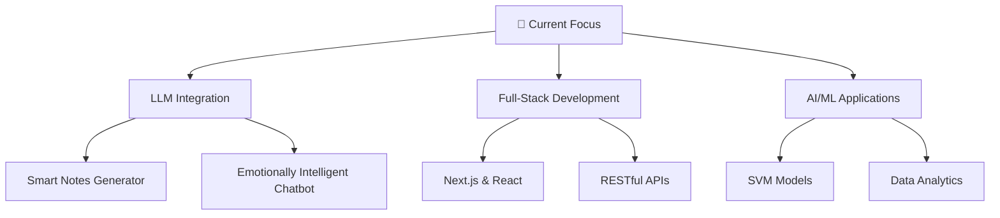

# Hi there, I'm Gautham Nambiar! 👋

<div align="center">
  
[](https://git.io/typing-svg)

</div>

<div align="center">
  
</div>

## 🚀 About Me

```typescript
const gautham = {
    location: "Bengaluru, Karnataka, India 🇮🇳",
    currentStatus: "MCA Graduate | Aspiring Software Developer",
    focus: ["Full-Stack Development", "Machine Learning", "AI/LLMs"],
    passion: "Building scalable solutions that deliver actionable business insights",
    funFact: "Built a WiFi-controlled car with only ₹500 in components! 🚗⚡"
};
```

<div align="center">
  
</div>

## 🛠️ Tech Arsenal

### 💻 Programming Languages
<div align="center">
  


</div>

### 🌐 Frontend Development
<div align="center">
  


</div>

### ⚙️ Backend & Database
<div align="center">
  


</div>

### 🔧 Tools & Platforms
<div align="center">
  


</div>

## 🎯 Current Focus & Learning

<div align="center">
  


</div>

## 🚀 Featured Projects

<div align="center">
  
| Project | Description | Tech Stack | Status |
|---------|-------------|------------|--------|
| 🤖 **Smart Note Generator** | AI-powered app processing PDFs, images, Word docs | JavaScript, PDF.js, Tesseract.js | 🔥 Active |
| 📋 **Notice Board System** | Role-based system with 3 dashboards | Next.js, Node.js, MongoDB | ✅ Completed |
| 🏥 **Disease Prediction ML** | ML models with 90%+ accuracy | Python, SVM, scikit-learn | ✅ Completed |
| 🚗 **WiFi Controlled Car** | IoT project with real-time control | Arduino, ESP8266, HTML5 | ✅ Completed |

</div>


## 🏆 Achievements & Experience

<div align="center">

### 💼 Professional Experience
**Frontend Engineering Intern** @ Vaishnav Technologies  
*Nov 2024 - Jan 2025*
- 🚀 Built responsive portfolio website with React.js
- 📈 Improved user engagement by 25%
- ⚡ Achieved 40% reduction in load times

### 🎓 Education
**Master of Computer Applications** - *RV Institute of Technology and Management*  
**Bachelor of Computer Applications** - *Acharya Institute Of Graduate Studies* (CGPA: 8.3/10.0)

### 🏅 Leadership
**Coordinator - Result Team** @ RVITM-IT Fest (March 2025)

</div>

## 🌟 Skills Visualization

<div align="center">
  
```ascii
    Frontend     Backend      Database     Tools
    ████████     ███████      ██████       ████████
    90%          80%          75%          85%
```

</div>

## 🤝 Let's Connect!

<div align="center">
  
[](https://www.linkedin.com/in/kgnambiar)
[](mailto:gauthamkn69@gmail.com)
[](https://your-portfolio.com)
[](https://github.com/YourGitHubUsername)

</div>


## 💡 Fun Facts & Quotes

<div align="center">
  
> "Code is like humor. When you have to explain it, it's bad." – Cory House

🔥 **Random Dev Fact:** I once optimized a website to load 40% faster using Chrome DevTools!  
🎯 **Goal:** To build AI solutions that make education more accessible  
⚡ **Superpower:** Turning complex problems into elegant solutions  

</div>

---

<div align="center">
  
### 🌟 "Building the future, one commit at a time" 🌟

[](https://github.com/YourGitHubUsername)

**Thanks for visiting my profile! Let's build something amazing together! 🚀**

</div>

---

<div align="center">
  
</div>
