#  Hi there, I'm Gautham Nambiar!

<div align="center">
  
[](https://git.io/typing-svg)

</div>


##  About Me

<div align="center">

```javascript
const gauthamNambiar = {
    location: "📍 Bengaluru, Karnataka, India 🇮🇳",
    education: "🎓 MCA Graduate",
    currentRole: "💼 Aspiring Software Developer",
    focus: ["🔧 Full-Stack Development", "🤖 Machine Learning", "🧠 AI/LLMs"],
    passion: "🎯 Building scalable solutions that deliver actionable business insights",
    motto: "💡 Code. Create. Innovate."
};

console.log("Welcome to my GitHub profile! 🚀");
```

</div>

##  Tech Arsenal

### 🎯 Languages & Frameworks
<div align="center">


</div>

### 🗄️ Databases & Cloud
<div align="center">


</div>

### 🛠️ Tools & Technologies
<div align="center">


</div>

##  Current Focus & Journey

<div align="center">



</div>

##  Featured Projects

<div align="center">

|  Project | 📋 Description | 🛠️ Tech Stack | 🔗 Status |

```mermaid
graph LR
    A[🎯 Learning Path] --> B[🤖 LLM Integration]
    A --> C[⚡ Full-Stack Mastery]
    A --> D[🧠 AI/ML Deep Dive]
    
    B --> E[📝 Smart Apps]
    B --> F[💬 Intelligent Bots]
    
    C --> G[⚛️ React Ecosystem]
    C --> H[🔌 RESTful APIs]
    
    D --> I[📊 Data Science]
    D --> J[🔍 Analytics]
    
    style A fill:#58a6ff,stroke:#58a6ff,stroke-width:2px,color:#ffffff
    style B fill:#238636,stroke:#238636,stroke-width:2px,color:#ffffff
    style C fill:#da3633,stroke:#da3633,stroke-width:2px,color:#ffffff
    style D fill:#8250df,stroke:#8250df,stroke-width:2px,color:#ffffff
```

|:---:|:---:|:---:|:---:|
| **🤖 Smart Note Generator** | AI-powered document processing app for PDFs, images, and Word files | `JavaScript` `PDF.js` `Tesseract.js` `AI APIs` |  |
| **📋 Notice Board System** | Role-based management system with multiple dashboards | `Next.js` `Node.js` `MongoDB` `JWT` |  |
| **🏥 Disease Prediction ML** | Machine learning models achieving 90%+ accuracy | `Python` `SVM` `scikit-learn` `Pandas` |  |
| **🚗 WiFi Controlled Car** | IoT project with real-time wireless control | `Arduino` `ESP8266` `HTML5` `WebSockets` |  |

</div>

##  GitHub Analytics

<div align="center">
  


</div>

<div align="center">
  
[](https://git.io/streak-stats)

</div>

##  Activity Graph

<div align="center">
  
[](https://github.com/ashutosh00710/github-readme-activity-graph)

</div>

##  Let's Connect & Collaborate!

<div align="center">

[](https://www.linkedin.com/in/kgnambiar)
[](mailto:gauthamkn69@gmail.com)
[](https://your-portfolio.com)
[](https://twitter.com/yourusername)

</div>

---

<div align="center">

###  Support My Work

[](https://www.buymeacoffee.com/yourusername)
[](https://ko-fi.com/yourusername)

</div>

<div align="center">
  
[](https://github.com/YourGitHubUsername)


**✨ Thanks for visiting my profile! Let's build something amazing together! ✨**


</div>
